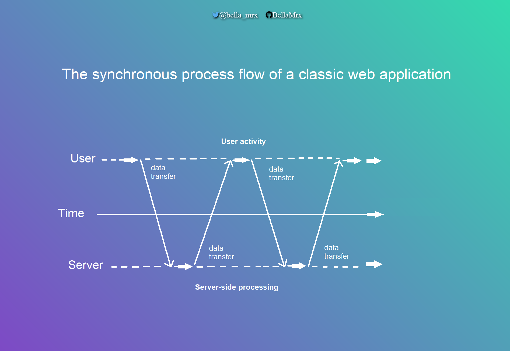
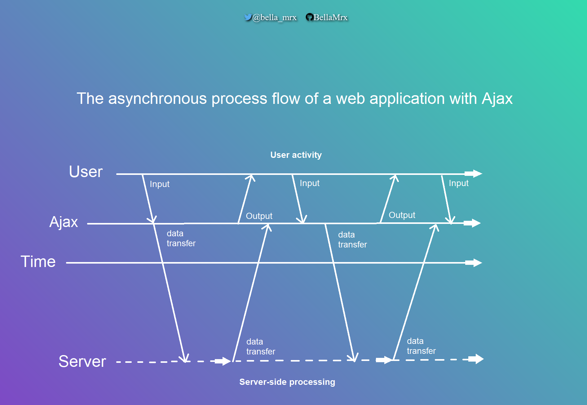
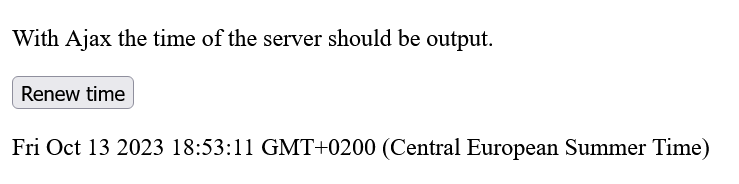

# JavaScript_Introduction_to_Ajax

 JavaScript: An Introduction to Ajax Programming

----------------------------------------------------

## Content
 1. An Introduction to Ajax Programming
    - 1.1. A simple example during execution
    - 1.2. Create the `XMLHttpRequest` object
    - 1.3. Make a request to the server
    - 1.4. Send data
    - 1.5. Get the status of the `XMLHttpRequest` object
    - 1.6. Forward the response from the server
    - 1.7. A more complex Ajax example with XML and DOM


---------------------------------------------------------

# 1. An Introduction to Ajax Programming
**Ajax** (Asynchronous JavaScript and XML) is used to transfer data asynchronously between a web browser and a web server.

It is a way to refresh individual parts of a web page without reloading the entire web page. This means with Ajax it is possible to create faster dynamic web pages. This reduces the amount of data transfer.

Asynchronous with Ajax means that script execution continues when an HTTP request is made, because this request to the web server is executed in the background, and the user can continue to use the page. Without Ajax, this process is synchronous, which means that script execution stops until the requested data comes back from the web server.

#### XML (Extensible Markup Language).
**XML** is a markup language in which data is hierarchically structured as text data. **XML** is used for exchanging data between different computer systems and especially over the Internet. The **X** in **Ajax** stands for **XML** but in practice, *JSON* is used more and more.

#### The synchronous process flow of a classic web application

 
 

#### The asynchronous process flow of a web application with Ajax

 


One advantage of Ajax is that Ajax applications are independent of the web browser and operating system, and just about any web browser can handle them. 
The Ajax application often consists of a combination of components: 

 - the HTTP request with the `XMLHttpRequest` object to exchange the data with the server asynchronously.
 - JavaScript/DOM for displaying and interacting with the information and data 
 - XML as the format for data transfer
 - CSS for the layout of the data


## 1.1. A simple example during execution
This example cannot be tested offline and should therefore be run on a real web server. 

  [Complete Code](https://github.com/BellaMrx/JavaScript_Introduction_to_Ajax/tree/main/Part_1) --> **Examples/Part_1/...** 

index.html:
   ```
    <head>
        <meta charset="utf-8">
        <title>Simple Ajax example</title>
        <script src="script.js"></script>
    </head>
    <body onload="timestamp()">
        <p id="refreshtime">With Ajax the time of the server should be output.</p>
        <button type="button" onclick="changeContent()">Renew time</button>
        <p id="timestamp"></p>
    </body>
   ```

The example contains a `p` element with the ID `refreshtime` and a button that calls the function `changeContent`. Behind the button is another `p` element with the ID `timestamp`. When the web page is loaded (`onload`), the function `timestamp()` is also executed, which was noted in the `body` element. Basically, it is an ordinary HTML file that uses various JavaScript functions as event handlers.

script.js
   ```
    function changeContent() {
      let xmlhttp = null;
      if (window.XMLHttpRequest) {
         xmlhttp = new XMLHttpRequest();
      }
      if (xmlhttp == null) {
         console.log("Error while creating an XMLHttpRequest object");
      }
      xmlhttp.onreadystatechange = function() {
          if (xmlhttp.readyState == 4 && xmlhttp.status == 200) {
            document.querySelector('#refreshtime').innerHTML = xmlhttp.responseText;
          }
      }
      xmlhttp.open("GET", "php/server-time.php", false);
      xmlhttp.send();
    }

    function timestamp() {
      let today = new Date();
      document.querySelector('#timestamp').innerHTML = today;
    }
   ```

The PHP script should be located in the same directory as **index.html**.

   ```
    <?php
        echo date('l jS \of F Y h:i:s A');
    ?>
   ```

 


## 1.2. Create the `XMLHttpRequest` object 
This `XMLHttpRequest` object is needed to exchange data with a web server and thus refresh individual parts of a web page without having to reload the entire web page.

  [Complete Code](https://github.com/BellaMrx/JavaScript_Introduction_to_Ajax/tree/main/Part_1) --> **Examples/Part_1/...** 

script.js
   ```
    function changeContent() {
      let xmlhttp;

      if (window.XMLHttpRequest) {
         xmlhttp = new XMLHttpRequest();
      }

    ...
    }
    ...
   ```


## 1.3. Make a request to the server
With the created `XMLHttpRequest` object a request can be made to the server to exchange data with it. To create such a request, the `open()` method must be used to connect to the target page and `send()` is used to specify the parameters of the `XMLHttpRequest` object.

  [Complete Code](https://github.com/BellaMrx/JavaScript_Introduction_to_Ajax/tree/main/Part_1) --> **Examples/Part_1/...**

script.js
   ```
    ...
      xmlhttp.open("GET", "php/server-time.php", true);
      xmlhttp.send();
    ...
   ```

The `open()` method has the syntax:
`open(method, url, async)`.

The `method` specifies the method of the request (HTTP request method), which is usually **GET** or **POST**.

The `url` specifies the path or URl to the file on the server to be requested. This can be any file.

The `async` specifies whether the request should be executed asynchronously (`true`) or synchronously (`false`). Mostly an asynchronous transfer is recommended, so set the value to `true`, which is what Ajax (Asynchronous JavaScript and XML) stands for. The advantage of asynchronous data transfer is that a JavaScript does not have to wait for the server's response. With synchronous transfer a JavaScript is not executed further until the answer from the server is there.

 - async = true stands for asynchronous and ensures that the script continues to run as the HTTP request is executed in the background.
 
 - async = false stands for synchronous and causes the script execution to stop until the data is returned from the server.

The `send()` method sends the request along with the data to the server.


## 1.4. Send data
If `GET` was used as a method, then the parameters can be written directly into the URL.

   ```
    ...
      xmlhttp.open("GET", "test.php?name=bella&zip=1234", true);
      xmlhttp.send();
    ...
   ```

With `POST` the data can be specified in the `send()` method of the `XMLHttpRequest` object. In addition, a special HTTP header must be sent with `POST`. This is done with the `setRequestHeader()` method. The required HTTP header is `Content-Type`, and the corresponding value is `"application/x-www-form-urlencoded"`. This MIME type is used for the form data.

   ```
    ...
      xmlhttp.open("POST", "test.php", true);
      xmlhttp.setRequestHeader("Content-Type", "application/x-www-form-urlencoded");
      xmlhttp.send("name=bella&zip=1234");
    ...
   ```


## 1.5. Get the status of the `XMLHttpRequest` object
A callback function is needed which is called when the results come back from the web server. In the callback function `onreadystatechange` is passed to the `XMLHttpRequest` property.

   ```
    xmlhttp.onreadystatechange = function() {...};
   ```

A function name can also be passed as a reference if required:

   ```
    function oneFunction() {...}
    ...
    xmlhttp.onreadystatechange = oneFunction;
   ```

The `onreadystatechange` event is fired whenever the state of the `XMLHttpRequest` object changes.

In the callback function, the state of the `XMLHttpRequest` object is first checked with the `readyState` property. There are five different states:

| Value | Status             | Description  |
| ----- | ------------------ | ------------ |
| 0     | `UNSENT` 			 | The function `open()` has not been called yet. |
| 1     | `OPENED` 			 | The function `send()` has not been called yet. |
| 2     | `HEADERS_RECEIVED` | The `send()` function has already been called, and header and status are available. |
| 3     | `LOADING` 	     | The download is in progress, but the `responseText` is not yet complete. |
| 4     | `DONE` 			 | The process has been fully completed. |

In addition to the status of the `XMLHttpRequest` object, the status of the response to the request is significant. The classic value `404` is returned if the requested page could not be returned.

List with common status codes: 

| Value | Message       | Description |
| ----- | ------------- | ------------ |
| `200` | `OK` 			| The request was successfully processed and the result of the response was transmitted. |
| `400` | `Bad Request` | The request message was incorrect. |
| `403` | `Forbidden` 	| The request could not be performed because there is no authorization. |
| `404` | `Not Found` 	| The requested resource was not found on the web server. |

This is how the state of the `XMLHttpRequest` object is checked:

   ```
    xmlhttp.onreadystatechange = function() {
        if (xmlhttp.readyState == 4 && xmlhttp.status == 200) {
            document.querySelector('#refreshtime').innerHTML = xmlhttp.responseText;
        }
    }
   ```

`onreadystatechange` is passed to the callback function to be called when the server response is there. This function is called whenever the state of the `readyState` property has changed.
In this example, the text in `responseText` is inserted when `readyState` is equal to `4` and the status of the response in `status` is equal to `200`. The `responseText` attribute contains the web server's response to the request as text or `null` if the request was successful.

More information about the properties of the `XMLHttpRequest` object is available here: [MDN](https://developer.mozilla.org/en-US/docs/Web/API/XMLHttpRequest)


## 1.6. Forward the response from the server 
The response from the server is contained in the `responseText` or `responseXML` property of the `XMLHttpRequest` object. The data contained in it can then be further processed. The returned text is inserted into the HTML element as new text:

   ```
    document.querySelector('#refreshtime').innerHTML = xmlhttp.responseText;
   ```

If the return from the server is not XML, the `responseText` property should always be used, in which the returned data is an ordinary string. If, on the other hand, the return from the server is XML encoded and the data is to be parsed as an XML object, the `responseXML` property must be used.


### The php script
The php-script in this example, returns only an indication from date and time.

   ```
    <?php
      echo date('l jS \of F Y h:i:s A');
    ?> 
   ```


### The complete example on execution
The first paragraph with the text `With Ajax the time of the server should be output.` is changed when the user presses the button. The timestamp behind the button is already set using the JavaScript function `timestamp()` when the web page is loaded with `onload` in the `body` element.
For this process, *Ajax* has now been used with the `XMLHttpRequest` object. The button can be used as often as you like, and always the time output will be updated.
However, the web page is not completely reloaded, but only individual information or components of the web page are updated.

  


## 1.7. A more complex Ajax example with XML and DOM


