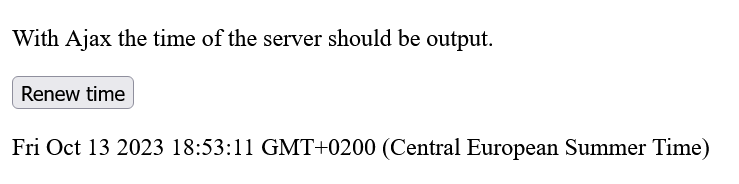

# JavaScript_Introduction_to_Ajax

 JavaScript: An Introduction to Ajax Programming

----------------------------------------------------

## Content
 1. An Introduction to Ajax Programming
    - 1.1. A simple example during execution
    - 1.2. Create the `XMLHttpRequest` object


---------------------------------------------------------

# 1. An Introduction to Ajax Programming
**Ajax** (Asynchronous JavaScript and XML) is used to transfer data asynchronously between a web browser and a web server.

#### XML (Extensible Markup Language).
**XML** is a markup language in which data is hierarchically structured as text data. **XML** is used for exchanging data between different computer systems and especially over the Internet. The **X** in **Ajax** stands for **XML** but in practice, *JSON* is used more and more.


It is a way to refresh individual parts of a web page without reloading the entire web page. This means with Ajax it is possible to create faster dynamic web pages. This reduces the amount of data transfer.

Asynchronous with Ajax means that script execution continues when an HTTP request is made, because this request to the web server is executed in the background, and the user can continue to use the page. Without Ajax, this process is synchronous, which means that script execution stops until the requested data comes back from the web server.


#### The synchronous process flow of a classic web application

 
 

#### The asynchronous process flow of a web application with Ajax

 


One advantage of Ajax is that Ajax applications are independent of the web browser and operating system, and just about any web browser can handle them. 
The Ajax application often consists of a combination of components: 

 - the HTTP request with the `XMLHttpRequest` object to exchange the data with the server asynchronously.
 - JavaScript/DOM for displaying and interacting with the information and data 
 - XML as the format for data transfer
 - CSS for the layout of the data


## 1.1. A simple example during execution
This example cannot be tested offline and should therefore be run on a real web server. 

  [Complete Code](http) --> **Examples/Part_1/...** 

index.html:
   ```
    <head>
        <meta charset="utf-8">
        <title>Simple Ajax example</title>
        <script src="script.js"></script>
    </head>
    <body onload="timestamp()">
        <p id="refreshtime">With Ajax the time of the server should be output.</p>
        <button type="button" onclick="changeContent()">Renew time</button>
        <p id="timestamp"></p>
    </body>
   ```

The example contains a `p` element with the ID `refreshtime` and a button that calls the function `changeContent`. Behind the button is another `p` element with the ID `timestamp`. When the web page is loaded (`onload`), the function `timestamp()` is also executed, which was noted in the `body` element. Basically, it is an ordinary HTML file that uses various JavaScript functions as event handlers.

script.js
   ```
    function changeContent() {
      let xmlhttp = null;
      if (window.XMLHttpRequest) {
         xmlhttp = new XMLHttpRequest();
      }
      if (xmlhttp == null) {
         console.log("Error while creating an XMLHttpRequest object");
      }
      xmlhttp.onreadystatechange = function() {
          if (xmlhttp.readyState == 4 && xmlhttp.status == 200) {
            document.querySelector('#refreshtime').innerHTML = xmlhttp.responseText;
          }
      }
      xmlhttp.open("GET", "php/server-time.php", false);
      xmlhttp.send();
    }

    function timestamp() {
      let today = new Date();
      document.querySelector('#timestamp').innerHTML = today;
    }
   ```

The PHP script should be located in the same directory as **index.html**.

   ```
    <?php
        echo date('l jS \of F Y h:i:s A');
    ?>
   ```

 


## 1.2. Create the `XMLHttpRequest` object 
This `XMLHttpRequest` object is needed to exchange data with a web server and thus refresh individual parts of a web page without having to reload the entire web page.

  [Complete Code](http) --> **Examples/Part_1/...** 

script.js
   ```
    function changeContent() {
      let xmlhttp;

      if (window.XMLHttpRequest) {
         xmlhttp = new XMLHttpRequest();
      }

    ...
    }
    ...
   ```


