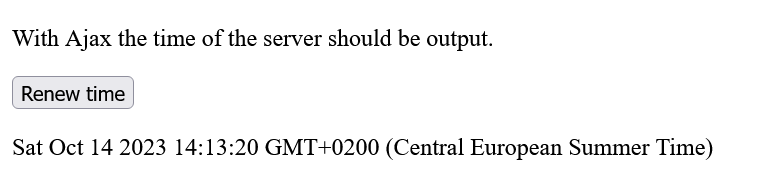
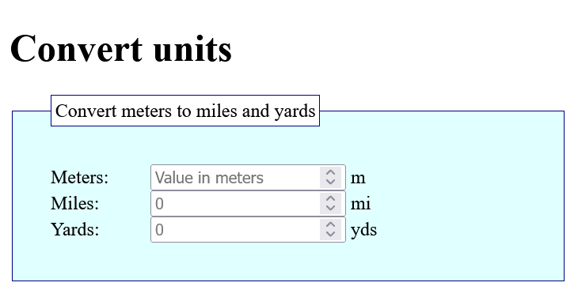

# JavaScript_Introduction_to_Ajax

 JavaScript: An Introduction to Ajax Programming

----------------------------------------------------

## Content
 1. An Introduction to Ajax Programming
    - 1.1. A simple example during execution
    - 1.2. Create the `XMLHttpRequest` object
    - 1.3. Make a request to the server
    - 1.4. Send data
    - 1.5. Get the status of the `XMLHttpRequest` object
    - 1.6. Forward the response from the server
    - 1.7. A more complex Ajax example with XML and DOM
    - 1.8. The JSON data format with Ajax
 2. introduction to JavaScript library jQuery
    - 2.1. Include jQuery in the HTML document
    - 2.2. The basic use of jQuery
    - 2.3. The convenient jQuery selectors
    - 2.4. jQuery events
    - 2.5. Query and set content and HTML attributes with jQuery
    - 2.6. Add and delete HTML elements with jQuery
    - 2.7. Manipulate CSS with jQuery
    - 2.8. jQuery effects and animations


---------------------------------------------------------

# 1. An Introduction to Ajax Programming
**Ajax** (Asynchronous JavaScript and XML) is used to transfer data asynchronously between a web browser and a web server.

It is a way to refresh individual parts of a web page without reloading the entire web page. This means with Ajax it is possible to create faster dynamic web pages. This reduces the amount of data transfer.

Asynchronous with Ajax means that script execution continues when an HTTP request is made, because this request to the web server is executed in the background, and the user can continue to use the page. Without Ajax, this process is synchronous, which means that script execution stops until the requested data comes back from the web server.

#### XML (Extensible Markup Language).
**XML** is a markup language in which data is hierarchically structured as text data. **XML** is used for exchanging data between different computer systems and especially over the Internet. The **X** in **Ajax** stands for **XML** but in practice, *JSON* is used more and more.

#### The synchronous process flow of a classic web application

 
 

#### The asynchronous process flow of a web application with Ajax

 


One advantage of Ajax is that Ajax applications are independent of the web browser and operating system, and just about any web browser can handle them. 
The Ajax application often consists of a combination of components: 

 - the HTTP request with the `XMLHttpRequest` object to exchange the data with the server asynchronously.
 - JavaScript/DOM for displaying and interacting with the information and data 
 - XML as the format for data transfer
 - CSS for the layout of the data


## 1.1. A simple example during execution
This example cannot be tested offline and should therefore be run on a real web server. 

  [Complete Code](https://github.com/BellaMrx/JavaScript_Introduction_to_Ajax/tree/main/Examples/Part_1) --> **Examples/Part_1/...** 

index.html:
   ```
    <head>
        <meta charset="utf-8">
        <title>Simple Ajax example</title>
        <script src="script.js"></script>
    </head>
    <body onload="timestamp()">
        <p id="refreshtime">With Ajax the time of the server should be output.</p>
        <button type="button" onclick="changeContent()">Renew time</button>
        <p id="timestamp"></p>
    </body>
   ```

The example contains a `p` element with the ID `refreshtime` and a button that calls the function `changeContent`. Behind the button is another `p` element with the ID `timestamp`. When the web page is loaded (`onload`), the function `timestamp()` is also executed, which was noted in the `body` element. Basically, it is an ordinary HTML file that uses various JavaScript functions as event handlers.

script.js
   ```
    function changeContent() {
      let xmlhttp = null;
      if (window.XMLHttpRequest) {
         xmlhttp = new XMLHttpRequest();
      }
      if (xmlhttp == null) {
         console.log("Error while creating an XMLHttpRequest object");
      }
      xmlhttp.onreadystatechange = function() {
          if (xmlhttp.readyState == 4 && xmlhttp.status == 200) {
            document.querySelector('#refreshtime').innerHTML = xmlhttp.responseText;
          }
      }
      xmlhttp.open("GET", "php/server-time.php", false);
      xmlhttp.send();
    }

    function timestamp() {
      let today = new Date();
      document.querySelector('#timestamp').innerHTML = today;
    }
   ```

The PHP script should be located in the same directory as **index.html**.

   ```
    <?php
        echo date('l jS \of F Y h:i:s A');
    ?>
   ```

 


## 1.2. Create the `XMLHttpRequest` object 
This `XMLHttpRequest` object is needed to exchange data with a web server and thus refresh individual parts of a web page without having to reload the entire web page.

  [Complete Code](https://github.com/BellaMrx/JavaScript_Introduction_to_Ajax/tree/main/Examples/Part_1) --> **Examples/Part_1/...** 

script.js
   ```
    function changeContent() {
      let xmlhttp;

      if (window.XMLHttpRequest) {
         xmlhttp = new XMLHttpRequest();
      }

    ...
    }
    ...
   ```


## 1.3. Make a request to the server
With the created `XMLHttpRequest` object a request can be made to the server to exchange data with it. To create such a request, the `open()` method must be used to connect to the target page and `send()` is used to specify the parameters of the `XMLHttpRequest` object.

  [Complete Code](https://github.com/BellaMrx/JavaScript_Introduction_to_Ajax/tree/main/Examples/Part_1) --> **Examples/Part_1/...**

script.js
   ```
    ...
      xmlhttp.open("GET", "php/server-time.php", true);
      xmlhttp.send();
    ...
   ```

The `open()` method has the syntax:
`open(method, url, async)`.

The `method` specifies the method of the request (HTTP request method), which is usually **GET** or **POST**.

The `url` specifies the path or URl to the file on the server to be requested. This can be any file.

The `async` specifies whether the request should be executed asynchronously (`true`) or synchronously (`false`). Mostly an asynchronous transfer is recommended, so set the value to `true`, which is what Ajax (Asynchronous JavaScript and XML) stands for. The advantage of asynchronous data transfer is that a JavaScript does not have to wait for the server's response. With synchronous transfer a JavaScript is not executed further until the answer from the server is there.

 - async = true stands for asynchronous and ensures that the script continues to run as the HTTP request is executed in the background.
 
 - async = false stands for synchronous and causes the script execution to stop until the data is returned from the server.

The `send()` method sends the request along with the data to the server.


## 1.4. Send data
If `GET` was used as a method, then the parameters can be written directly into the URL.

   ```
    ...
      xmlhttp.open("GET", "test.php?name=bella&zip=1234", true);
      xmlhttp.send();
    ...
   ```

With `POST` the data can be specified in the `send()` method of the `XMLHttpRequest` object. In addition, a special HTTP header must be sent with `POST`. This is done with the `setRequestHeader()` method. The required HTTP header is `Content-Type`, and the corresponding value is `"application/x-www-form-urlencoded"`. This MIME type is used for the form data.

   ```
    ...
      xmlhttp.open("POST", "test.php", true);
      xmlhttp.setRequestHeader("Content-Type", "application/x-www-form-urlencoded");
      xmlhttp.send("name=bella&zip=1234");
    ...
   ```


## 1.5. Get the status of the `XMLHttpRequest` object
A callback function is needed which is called when the results come back from the web server. In the callback function `onreadystatechange` is passed to the `XMLHttpRequest` property.

   ```
    xmlhttp.onreadystatechange = function() {...};
   ```

A function name can also be passed as a reference if required:

   ```
    function oneFunction() {...}
    ...
    xmlhttp.onreadystatechange = oneFunction;
   ```

The `onreadystatechange` event is fired whenever the state of the `XMLHttpRequest` object changes.

In the callback function, the state of the `XMLHttpRequest` object is first checked with the `readyState` property. There are five different states:

| Value | Status             | Description  |
| ----- | ------------------ | ------------ |
| 0     | `UNSENT` 			 | The function `open()` has not been called yet. |
| 1     | `OPENED` 			 | The function `send()` has not been called yet. |
| 2     | `HEADERS_RECEIVED` | The `send()` function has already been called, and header and status are available. |
| 3     | `LOADING` 	     | The download is in progress, but the `responseText` is not yet complete. |
| 4     | `DONE` 			 | The process has been fully completed. |

In addition to the status of the `XMLHttpRequest` object, the status of the response to the request is significant. The classic value `404` is returned if the requested page could not be returned.

List with common status codes: 

| Value | Message       | Description |
| ----- | ------------- | ------------ |
| `200` | `OK` 			| The request was successfully processed and the result of the response was transmitted. |
| `400` | `Bad Request` | The request message was incorrect. |
| `403` | `Forbidden` 	| The request could not be performed because there is no authorization. |
| `404` | `Not Found` 	| The requested resource was not found on the web server. |

This is how the state of the `XMLHttpRequest` object is checked:

   ```
    xmlhttp.onreadystatechange = function() {
        if (xmlhttp.readyState == 4 && xmlhttp.status == 200) {
            document.querySelector('#refreshtime').innerHTML = xmlhttp.responseText;
        }
    }
   ```

`onreadystatechange` is passed to the callback function to be called when the server response is there. This function is called whenever the state of the `readyState` property has changed.
In this example, the text in `responseText` is inserted when `readyState` is equal to `4` and the status of the response in `status` is equal to `200`. The `responseText` attribute contains the web server's response to the request as text or `null` if the request was successful.

More information about the properties of the `XMLHttpRequest` object is available here: [MDN](https://developer.mozilla.org/en-US/docs/Web/API/XMLHttpRequest)


## 1.6. Forward the response from the server 
The response from the server is contained in the `responseText` or `responseXML` property of the `XMLHttpRequest` object. The data contained in it can then be further processed. The returned text is inserted into the HTML element as new text:

   ```
    document.querySelector('#refreshtime').innerHTML = xmlhttp.responseText;
   ```

If the return from the server is not XML, the `responseText` property should always be used, in which the returned data is an ordinary string. If, on the other hand, the return from the server is XML encoded and the data is to be parsed as an XML object, the `responseXML` property must be used.


### The php script
The php-script in this example, returns only an indication from date and time.

   ```
    <?php
      echo date('l jS \of F Y h:i:s A');
    ?> 
   ```


### The complete example on execution
The first paragraph with the text `With Ajax the time of the server should be output.` is changed when the user presses the button. The timestamp behind the button is already set using the JavaScript function `timestamp()` when the web page is loaded with `onload` in the `body` element.
For this process, *Ajax* has now been used with the `XMLHttpRequest` object. The button can be used as often as you like, and always the time output will be updated.
However, the web page is not completely reloaded, but only individual information or components of the web page are updated.

  


## 1.7. A more complex Ajax example with XML and DOM
In this example, a web page will communicate with the web server while the user is typing something into an input field using the keyboard.

  [Complete Code](https://github.com/BellaMrx/JavaScript_Introduction_to_Ajax/tree/main/Examples/Part_2) --> **Examples/Part_2/...**

index.html
   ```
    <h1>Convert units</h1>
    <form>
        <fieldset>
            <legend>Convert meters to miles and yards</legend>
            <label>Meters:</label>
            <input type="number" id="meter" placeholder="Value in meters" onkeyup="recalculate(this.value);"> m
            <br><label>Miles:</label>
            <input type="number" id="miles" placeholder="Conversion miles" readonly> mi
            <br><label>Yards:</label>
            <input type="number" id="yards" placeholder="Yard conversion" readonly> yds
        </fieldset>
    </form> 
   ```

 

Here an input can be made in numeric input. After each keystroke (`onkeyup`) the value is sent to the web server with the event handler `recalculate()` via *Ajax*.

script.js
   ```
    let xmlhttp = null;

    function recalculate(str) {
      if (window.XMLHttpRequest) {
        xmlhttp = new XMLHttpRequest();
      }
      if (xmlhttp == null) {
        console.log("Error while creating an XMLHttpRequest object");
      }
      xmlhttp.open("GET", "calc.php?meter=" + str, true);
      xmlhttp.onreadystatechange = parseRecalculate;
      xmlhttp.send();
    }

    function parseRecalculate() {
      if (xmlhttp.readyState == 4 && xmlhttp.status == 200) {
        let xml = xmlhttp.responseXML;
        let miles_response = xml.querySelector('miles');
        let yards_response = xml.querySelector('yards');

        document.querySelector('#miles').value = miles_response.firstChild.nodeValue;
        document.querySelector('#yards').value = yards_response.firstChild.nodeValue;
      } else {
        document.querySelector('#miles').value = 0;
        document.querySelector('#yards').value = 0;
      }
    }
   ```

First, a new `XMLHttpRequest` object is created in `recalculate(str)`. Then, the entered value is transmitted asynchronously to the web server via Ajax after each keystroke. The entered value in `str` is assembled directly after the URL of the `open()` method. Here the `GET` method is used, because it is only one value.
Here instead of an anonymous function a reference of an already existing function was assigned as callback function `onreadystatechange` with `parseRecalculate`. This function will take care of everything else once the request has been sent with `send()` and the response from the web server is there.

In the PHP script, the passed value in `meter` is calculated on the web server and an XML encoded calculation is returned as response:

calc.php
   ```
    <?php
      header("Content-Type: text/xml");
      $meter = $_REQUEST['meter'];
      $miles = $meter * 0.0006213711922373339;
      $yards = $meter * 1.0936133;
      echo "<?xml version=\"1.0\" encoding=\"utf-8\"?>";
    ?>

    <conversion>
      <meter><?php echo $meter; ?></meter>
      <miles><?php echo $miles;  ?></miles>
      <yard><?php echo $yards;  ?></yard>
    </conversion>
   ```

The passed value is fetched with `$_REQUEST['meter']` and passed to the variable `$meter`. Then the value is converted to miles and yards and stored in the variables `$miles` and `$yards`. After that the return is generated as XML encoded output as response:

   ```
    <?xml version="1.0" encoding="utf-8"?>
    <conversion>
      <meter>1000</meter>
      <miles>0.62137119223733</miles>
      <yard>1093.6133</yard>
    </conversion>
   ```

This returned XML document is then evaluated with the `parseRecalculate()` callback function set up with `onreadystatechange`:

   ```
    function parseRecalculate() {
      if (xmlhttp.readyState == 4 && xmlhttp.status == 200) {
       // Response from the server
        let xml = xmlhttp.responseXML;
        let miles_response = xml.querySelector('miles');
        let yards_response = xml.querySelector('yards');

       // Write results
        document.querySelector('#miles').value = miles_response.firstChild.nodeValue;
        document.querySelector('#yards').value = yards_response.firstChild.nodeValue;
       // In case of an error
      } else {
        document.querySelector('#miles').value = 0;
        document.querySelector('#yards').value = 0;
      }
    }  
   ```

Here, `readyState` and `status` are first used to check whether the response from the server is ready. If it is, the response is contained in `responseXML` of the `XMLHttpRequest` object, because the response is now XML-encoded. Since XML files are used here, the response can be evaluated using the **DOM**. Here the value of the node `miles` and `yards` is to be determined:

   ```
    let miles_response = xml.querySelector('miles');
    let yards_response = xml.querySelector('yards'); 
   ```

Here you can see that with `responseXML` the DOM method can be accessed directly. The values `miles_response` and `yard_response` read from the XML document are finally written into the form fields as follows:

   ```
    document.querySelector('#miles').value = miles_response.firstChild.nodeValue;
    document.querySelector('#yards').value = yards_response.firstChild.nodeValue; 
   ```

 


## 1.8. The JSON data format with Ajax
A simple alternative to XML is **JSON**(JavaScript Object Notation) for exchanging information between server and client. JSON is probably now more widely used than XML.
With JSON, objects and arrays can be specified as an ordinary string, this process is called **serialization**.

An array can be specified between square brackets:

   ```
    ["text1", "text2", "text3", "text4"]
   ```

Objects are noted in curly brackets:

   ```
    {"Property1": "Value", "Property2" : "Value" }
   ```

The JSON data format can be read by any programming language.

Here is an example with an `dictionary` object:

   ```
    {"dictionary": [
      {"location": "Amsterdam", "zipcode":1234},
      {"location": "Tokyo", "zipcode":2468},
      {"location": "Cairo", "zipcode":1357}
    ] }
   ```

The property names (`location`, `zipcode`) must be enclosed in double quotes when notating JSON. Besides arrays and objects, numbers, strings(with "..."), boolean values (`true`, `false`) and `null` can be used as data types.

Since JSON uses the JavaScript syntax, it is quite easy to create such an array of objects in JS: 

   ```
    let dictionary = [
      {"location": "Amsterdam", "zipcode": 1234},
      {"location": "Tokyo", "zipcode": 2468},
      {"location": "Cairo", "zipcode": 1357}
    ];
   ```

And so it is then possible to access the individual entries with the help of JavaScript:

   ```
    let dictionary = [
      {"location": "Amsterdam", "zipcode": 1234},
      {"location": "Tokyo", "zipcode": 2468},
      {"location": "Cairo", "zipcode": 1357}
    ];

    document.querySelector('#output').innerHTML = "<ul>" +
    "<li>" + dictionary[0].location + " = " + dictionary[0].zipcode + "</li>" +
    "<li>" + dictionary[1].location + " = " + dictionary[1].zipcode + "</li>" +
    "<li>" + dictionary[2].location + " = " + dictionary[2].zipcode + "</li></ul>";
   ```

  [Complete Code](https://github.com/BellaMrx/JavaScript_Introduction_to_Ajax/tree/main/Examples/Part_3) --> **Examples/Part_3/...**

 

The data can also be modified:

   ```
    dictionary[0].location = "Madrid"    // Amsterdam turns into Madrid
   ```

Usually a `for` loop is used for traversing each element in the JSON.data format:

   ```
    ...
    let txt = "<ul>";
    for (let i = 0; i <ul dictionary.lengh; i++) {
      txt += "<li>" + dictionary[i].location + " = " + dictionary[i].zipcode + "</li>";
    }
    txt += "</ul>";
    document.querySelector('#output').innerHTML = txt;
    ...
   ```

In practice, JSON data formats are often used to read data from a web server in order to display it on the web page.

To convert a JSON text into a JavaScript object, there is a method called `JSON.parse()`:

   ```
    let obj = JSON.parse(text);
   ```

Example:

  [Complete Code](https://github.com/BellaMrx/JavaScript_Introduction_to_Ajax/tree/main/Examples/Part_4) --> **Examples/Part_4/...**

index.html
   ```
    <h1>JSON example</h1>
    <p id="output"></p>
    <script src="script.js"></script>
   ```

script.js
   ```
    let xmlhttp = new XMLHttpRequest();
    let url = "data.json";

    xmlhttp.onreadystatechange = function() {
      if (xmlhttp.readyState == 4 && xmlhttp.status == 200) {
        var myArr = JSON.parse(xmlhttp.responseText);
        myParse(myArr);
      }
    }
    xmlhttp.open("GET", url, true);
    xmlhttp.send();

    function myParse(arr) {
      let out = '<ul>';
      for (let i = 0; i < arr.length; i++) {
        out += '<li>' + '<a href="' + arr[i].url + '">' +
            arr[i].location + '</a>' + " = " + arr[i].zipcode + '</li>';
      }
      out += '</ul>';
      document.querySelector('#output').innerHTML = out;
    }
   ```

Here a connection to the server is made and an HTTP request for the **data.json** file. If the request was successful, the string is parsed into JSON and creates an object:

   ```
    let myArr = JSON.parse(xmlhttp.responseText);
   ```

This data is passed to the function `myOutput()` where the content for the web page is compiled and displayed in HTML.

 

#### Fetch API
In practice, it is not necessary to go the complex route via the `XMLHttpRequest` object. For Ajax requests, for example, the Fetch API is a good choice. This is much easier to use.


# 2. Introduction to JavaScript library jQuery
It can be quite time-consuming to use only pure JavaScript. For recurring functions you can write and use your own small functions. Or you can simply use a JavaScript library.
One of the most popular JavaScript libraries is **jQuery**, which makes it much easier to use JavaScript for web pages. HTML/DOM manipulations, CSS manipulations, methods for events, effects and animations and also Ajax are only some topics that can be used much easier with jQuery.


## 2.1. Include jQuery in the HTML document
To use the jQuery library, it must be included. The jQuery library can be downloaded from [jQuery](https://jquery.com/download/) and included locally or jQuery can be included directly online from a **CDN** like Google or Microsoft.

When downloading JQuery to host it yourself, there is usually a *Production Version* and a *Development Version*. For a serious web project the *Production Version* is used, because this version is compressed and minimized, for testing the *Development Version* should be used. The downloaded file can be included into the HTML document with the `<script>` tag.

   ```
    <head>
      <script src="script.js"></script>
    </head>
   ```

If jQuery is to be included via CDN then:

   ```
    <head>
      <script src="https://ajax.googleapis.com/ajax/libs/jquery/3.7.1/jquery.min.js"></script>
    </head>
   ```

When jQuery is included via CDN, it can only work online. But the advantage of this is a faster loading time.


## 2.2. The basic use of jQuery

Example:

  [Complete Code](https://github.com/BellaMrx/JavaScript_Introduction_to_Ajax/tree/main/Examples/Part_5) --> **Examples/Part_5/...**

index.html
  ```
   <head>
     <meta charset="utf-8">
     <title>Integrate jQuery into the web page</title>
     <!-- <script src="https://ajax.googleapis.com/ajax/libs/jquery/3.7.1/jquery.min.js"></script> -->
     <script src="jquery-3.7.1.min.js"></script>
   </head>
   <body>
     <h1>Embedding jQuery</h1>
     <p></p>
     <script src="script.js"></script>
   </body>
  ```

script.js
  ```
   $(document).ready(function() {
     $("p").append("<b>jQuery was successfully integrated.</b>");
   });
  ```

 

  ```
   $("p").append("<b>jQuery was successfully integrated.</b>");
  ```

Here the HTML element is searched for all `p` elements and with `append()` the text `jQuery was successfully integrated.` is appended.

Here you can see the typical jQuery syntax for selecting HTML elements to perform an action on. Basic access in jQuery is almost always in the following form:

  ```
   $(Selector).action()
  ```

The `$` character is the variable through which JQuery is accessed by default. The `(selector)` is a query or a search for an HTML element. The `action()` specifies the action or method to be executed on that element.

The typical basic framework of jQuery:

  ```
   $(document).ready(function() {
    /* jQuery code */
   });
  ```

Here you can see that the jQuery code is noted inside `$(document).ready(function(){...})`. Via `ready()` a callback function is registered, which is called when the document is completely loaded. This avoids changing an element on the web page that has not been loaded yet.

#### Short notation

  ```
   $(function)() {
    /* jQuery code */
   }
  ```


## 2.3. The convenient jQuery selectors
The jQuery selectors are the most important part of the jQuery library because they are used to select and manipulate HTML elements. The elements can be selected based on the type, class, ID, attribute name, attribute value, etc. `$()` is a function call that is passed the selector as a parameter, i.e. `$(selector)`. The `$` character is shorthand for **jQuery()**.

The jQuery selector to search for ID attributes of an HTML tag is noted with the `#` character followed by the corresponding ID. So `$("#myid")` will search for an HTML element with the `id="myid"`. However, if an HTML element with a specific class is searched for, a dot `.` must be used instead of `#`, i.e. `$()".myclass"`. This will search for all HTML elements where `class="myclass"` has been noted. The principle is the same as for `document.querySelector()` and `document.querySelectorAll()`. 

Example:

  [Complete Code](https://github.com/BellaMrx/JavaScript_Introduction_to_Ajax/tree/main/Examples/Part_6) --> **Examples/Part_6/...**

index.html
  ```
     <script src="https://ajax.googleapis.com/ajax/libs/jquery/3.7.1/jquery.min.js"></script>
   </head>
   <body>
     <h1>Use selectors</h1>
     <p id="p01">Paragraph 1</p>
     <p class="class01">Paragraph 2</p>
     <p>Paragraph 3</p>
     <script src="script.js"></script>
   </body>
  ```

script.js
  ```
   $(document).ready(function() {
     $("p").append(" - <b>Element selector</b>");
     $("#p01").append(" - <b>ID selector</b>");
     $(".class01").append(" - <b>Class selector</b>");
   }); 
  ```

 

The first selector with `$("p")` appends the text `element selector` to the end of all `p` elements. With `$("#p01")` on the other hand, the text `ID selector` is appended to the HTML element only, with `id="p01"`. The last selector with `$(".class01")`, on the other hand, searches all HTML elements with `class="class01"` and appends the text `class selector` at the end.

The jQuery selectors can also be combined. For example, to select all `p` elements with `class="warning"`, the jQuery selector is written `$("p.warning")`. But because of the newer DOM methods `querySelector()` and `querySelectorAll()`, there is no need to use jQuery so much.

| jQuery selector           | Description  |
| ------------------------- | ------------ |
| `$("*")`                  | Select all elements |
| `$("div, p")`             | all `div` and `p` elements |
| `$("div.note")`           | all `p` elements with `class="note"` |
| `$("p:first")`            | the first `p` element |
| `$("p:last")`             | the last `p` element |
| `$("ul li:first")`        | the first `li` element in the first `<ul>` |
| `$("[src]")`              | all elements with the `src` attribute |
| `$("a[target='_blank']")` | all `a` elements where the value of the `target` attribute is equal to `_blank` |
| `$(":button")`            | all `button` elements and all `input` elements with `type="button"` |
| `$("div#alist ul")`       | all `ul` elements that are inside a `div` element with the `id="alist"` |
| `$("input[type=text]")`   | all `input` elements with `type="text"` |
| `$("tr:even")`            | all even `tr` elements |
| `$("tr:odd")`             | all odd `tr` elements |
| `$(":empty")`             | all elements that are empty |


## 2.4. jQuery events
For almost every DOM event there is a matching jQuery method. For example, to assign the `click` event to all `div` elements of a web page, the following must be noted:

  ```
   $("div").click(function () {
     // Respond to the click.event
   }); 
  ```

The anonymous function is used to specify what should happen when a `click` event is fired on the `div` element.

Here is an example of jQuery responding to `onclick`, `onmouseenter` and `onmouseleave`:

  [Complete Code](https://github.com/BellaMrx/JavaScript_Introduction_to_Ajax/tree/main/Examples/Part_7) --> **Examples/Part_7/...**

index.html
  ```
   ...
     <script src="https://ajax.googleapis.com/ajax/libs/jquery/3.7.1/jquery.min.js"></script>
   ...
   <body>
     <h1>jQuery events</h1>
     <button id="btn01">Click here</button>
     <p id="p01"></p>
     <script src="script.js"></script>
  </body>
  ```

script.js
  ```
   $(document).ready(function() {

      $("#btn01").click(function() {
        $("#p01").text("Button was clicked");
      });
      $("#btn01").mouseenter(function() {
        $("#p01").text("Mouse over the button");
      });
      $("#btn01").mouseleave(function() {
        $("#p01").text("Mouse has left the button");
      });

   });
  ```

 

Here, the jQuery events `click()`, `mouseenter()`, and `mouseleave()` are handled in conjunction with the `id="btn01"` element. The event is displayed in the paragraph text below. The text content of the selected paragraph text is changed with the jQuery `text()` method.

| jQuery event method | Description |
| ------------------- | ------------ |
| `click()`           | Mouse click on an HTML element |
| `dblclick()`        | Double-click on an HTML element |
| `mouseenter()`      | Mouse cursor has entered the area of the HTML element. |
| `mouseleave()`      | Mouse pointer has left the HTML element |
| `keypress()`        | Button above the HTML element was pressed |
| `keydown()`         | Button above the HTML element is currently depressed |
| `keyup()`           | Button above the HTML element was released |
| `submit()`          | The `submit` event was triggered, i.e. the sender button was pressed |
| `focus()`           | An input field receives the focus |
| `blur()`            | An input field has just lost the focus |
| `change()`          | An input field has lost focus and was changed during the time in focus  |

#### `hover()`
A bit more special is `hover()`, because this method can take two functions as a combination. 

  ```
   ...
   $("#btn01").hover( function() {
      $("#p01").text("Mouse over the button"); 
   },
   function() {
      $("#p01").text("Mouse has left the button"); 
   } );
   ...
  ```


## 2.5. Query and set content and HTML attributes with jQuery
Getting or setting content and attributes is implemented in jQuery using four jQuery methods.

| Method   | Description  |
| -------- | ------------ |
| `text()` | Sets or returns the text content of the selected element |
| `html()` | Sets or returns the text content of the selected element, including the HTML markup |
| `val()`  | Sets the content of an input field or returns the value it contains |
| `attr()` | Sets/changes the content of an attribute value or determines the value of the attribute |

Example:

  [Complete Code](https://github.com/BellaMrx/JavaScript_Introduction_to_Ajax/tree/main/Examples/Part_8) --> **Examples/Part_8/...**

index.html
  ```
   ...
     <script src="https://ajax.googleapis.com/ajax/libs/jquery/3.7.1/jquery.min.js"></script>
   ...
   <body>
     <h1>Read content with jQuery</h1>
     <button id="btn01">Readout</button>
     <p id="p01">I <b>am a</b> Text</p>
     <script src="script.js"></script>
   </body>
  ```

script.js
  ```
   $(document).ready(function() {

      $("#btn01").click(function() {
        let txt = $("#p01").text();
        let htm = $("#p01").html();
        console.log(txt + '\n' + htm);
        //alert(txt + '\n' + htm);
      });

   });
  ```

 

When the button is pressed , the content of the HTML element with `id="p01"` is read once with `text()` and once with `html()` and output in a web console.

It is also possible to set the content with a value:

  [Complete Code](https://github.com/BellaMrx/JavaScript_Introduction_to_Ajax/tree/main/Examples/Part_9) --> **Examples/Part_9/...**

index.html
  ```
   ...
     <script src="https://ajax.googleapis.com/ajax/libs/jquery/3.7.1/jquery.min.js"></script>
   ...
   <body>
     <h1>Set content with jQuery</h1>
     <input type="text" id="inp01" placeholder="Input here">
     <button id="btn01">Readout</button>
     <p id="txt">text()-Version</p>
     <p id="htm">html()-Version</p>
     <script src="script.js"></script>
   </body>
  ```

script.js
  ```
   $(document).ready(function() {

     $("#btn01").click(function() {
        let inp = "Your input: <b>";
        inp += $("#inp01").val() + "</b>";
        $("#txt").text(inp);
        $("#htm").html(inp);
        $("#inp01").val("Thanks");
     });

   });
  ```

 

When something is entered into the input field and the button is pressed, `val()` reads the content of the input field and assembles it into a string in the variable `inp`.

It is also possible to determine and change HTML attributes:

  [Complete Code](https://github.com/BellaMrx/JavaScript_Introduction_to_Ajax/tree/main/Examples/Part_10) --> **Examples/Part_10/...**

index.html
  ```
   ...
     <script src="https://ajax.googleapis.com/ajax/libs/jquery/3.7.1/jquery.min.js"></script>
   ...
   <body>
     <h1>Set content with jQuery</h1>
     <input type="text" id="inp01" placeholder="Input here">
     <button id="btn01">Readout</button>
     <p id="txt">text()-Version</p>
     <p id="htm">html()-Version</p>
     <script src="script.js"></script>
   </body>
  ```

script.js
  ```
   $(document).ready(function() {

     $("#btn01").click(function() {
        let backup = "Old link: " + $("a").attr("href");
        $("a").attr("href", $("#inp01").val());
        backup += "\nNew link: " + $("a").attr("href");
        // alert(backup);
        console.log(backup);
     });

   });
  ```

 

Here simply a link, with `href` attribute is replaced by a new link.


## 2.6. Add and delete HTML elements with jQuery
Also, jQuery provides methods for adding and removing content for the HTML elements:

| Method      | Description  |
| ----------- | ------------ |
| `append()`  | Adds a content to the end of the selected element. |
| `prepend()` | Adds a content to the beginning of the selected element. |
| `after()`   | Adds a content after the selected element. |
| `before()`  | Adds a content before the selected element. |
| `remove()`  | Removes the selected element and any child elements it may contain. |
| `empty()`   | Removes the child elements of the selected element. |

Example:

  [Complete Code](https://github.com/BellaMrx/JavaScript_Introduction_to_Ajax/tree/main/Examples/Part_11) --> **Examples/Part_11/...**

index.html
  ```
   ...
     <script src="https://ajax.googleapis.com/ajax/libs/jquery/3.7.1/jquery.min.js"></script>
   ...
     <h1>Add elements</h1>
     <div class="frame">
        <p>A paragraph text</p>
     </div>
     <div>
        <br>
        <button id="btn01">Add at the end</button>
        <button id="btn02">Add at the beginning</button><br>
        <button id="btn03">Add behind the end</button>
        <button id="btn04">Add before the beginning</button>
     </div>
     <script src="script.js"></script>
   </body>
  ```

script.js
  ```
   $(document).ready(function() {

     $("#btn01").click(function() {
        $(".frame").append("<p>Paragraph with append()</p>");
     });
     $("#btn02").click(function() {
        $(".frame").prepend("<p>Paragraph with prepend()</p>");
     });
     $("#btn03").click(function() {
        $(".frame").after("<p>Paragraph with after()</p>");
     });
     $("#btn04").click(function() {
        $(".frame").before("<p>Paragraph with before()</p>");
     });

   }); 
  ```

 

The methods for deleting elements with `remove()` and `empty()` work similarly:

  [Complete Code](https://github.com/BellaMrx/JavaScript_Introduction_to_Ajax/tree/main/Examples/Part_12) --> **Examples/Part_12/...**

index.html
  ```
   ...
     <script src="https://ajax.googleapis.com/ajax/libs/jquery/3.7.1/jquery.min.js"></script>
   ...
   <body>
     <h1>Remove elements</h1>
     <div class="frame">
        <p>A paragraph text</p>
        <p>A second paragraph text</p>
        <p>A third paragraph text</p>
     </div>
     <br>
     <button id="btn01">empty()-Method</button>
     <button id="btn02">remove()-Method</button>
     <script src="script.js"></script>
   </body>
  ```

script.js
  ```
   $(document).ready(function() {

     $("#btn01").click(function() {
        $(".frame").empty();
     });
     $("#btn02").click(function() {
        $(".frame").remove();
     });

   });
  ```

 


## 2.7. Manipulate CSS with jQuery

| Method          | Description  |
| --------------- | ------------ |
| `addClass()`    | Adds a class to the selected element |
| `removeClass()` | Removes a class from the selected element |
| `toggleClass()` | can add and remove a class from a selected element |
| `css()`         | Sets or determines style attributes for a selected element |

An example with `addClass()` and `removeClass()`:

  [Complete Code](https://github.com/BellaMrx/JavaScript_Introduction_to_Ajax/tree/main/Examples/Part_13) --> **Examples/Part_13/...**

index.html
  ```
   ...
     <script src="https://ajax.googleapis.com/ajax/libs/jquery/3.7.1/jquery.min.js"></script>
   ...
    <h1>Add and remove CSS</h1>
    <div class="note">
        <p>A paragraph text.</p>
        <p>A second paragraph text.</p>
        <p>A third paragraph text.</p>
    </div>
    <br>
    <button id="btn01">Add style</button>
    <button id="btn02">Remove style</button>
    <script src="script.js"></script>
  ```

style.css
  ```
   .frame {
     background: lightcyan;
     height: 250px;
     overflow: auto;
     width: 500px;
     border: 1px solid navy;
     padding: 1em;
     border-radius: 20px;
   }
   ...
  ```

script.js
  ```
   $(document).ready(function() {

     $("#btn01").click(function() {
        $(".note").addClass("frame");
     });
     $("#btn02").click(function() {
        $(".note").removeClass("frame");
     });

   });
  ```

 

Here the stylesheet can be added (`addClass()`) or removed (`removeClass()`) at any time by a click.

Adding and removing elements is easier with the `toggleClass()` method:

  [Complete Code](https://github.com/BellaMrx/JavaScript_Introduction_to_Ajax/tree/main/Examples/Part_14) --> **Examples/Part_14/...**

index.html
  ```
   ...
     <script src="https://ajax.googleapis.com/ajax/libs/jquery/3.7.1/jquery.min.js"></script>
   ...
    <h1>Add and remove CSS</h1>
    <div class="note">
        <p>A paragraph text.</p>
        <p>A second paragraph text.</p>
        <p>A third paragraph text.</p>
    </div>
    <br>
    <button id="btn01">Toggle Style</button>
    <script src="script.js"></script>
  ```

script.js
  ```
   $(document).ready(function() {

     $("#btn01").click(function() {
        $(".note").toggleClass("frame");
     });

   });  
  ```

 


The `css()` method gives access to individual CSS attributes:

  ```
   $("div").css("background-color", "green");  
  ```

Multiple CSS properties can also be used at once:

  ```
   $("div.note").css({
    "background-color", "red",
    "color": "white"
   });
  ```

If only one value of an element is to be determined, one must note only the name of the property with `css("property_name")`:

  ```
   let color = $("p.note").css("background-color");  
  ```


## 2.8. jQuery effects and animations
Creating animations with timers and intervals is quite complex in JavaScript. With jQuery it is simplified a bit.

#### An overview of the common jQuery methods Effects

| Method          | Description                                                             |
| --------------- | ----------------------------------------------------------------------- |
| `hide()`        | This hides a selected element.                                          |
| `show()`        | Displays a selected element again.                                      |
| `toggle()`      | Toggles between `hide()` and `show()` methods.                          |
| `fadeIn()`      | Slowly fades in a hidden element.                                       |
| `fadeOut()`     | Slowly fade out a visible element.                                      |
| `fadeToggle()`  | Toggles between the `fadeIn()` and `fadeOut()` methods.                 |
| `fadeTo()`      | Allows an element to be faded or transparent, the strength can be specified from `0.0` to `1.0`. |
| `slideDown()`   | Slides a selected element down.                                         |
| `slideUp()`     | Slide a selected element up.                                            |
| `slideToggle()` | Toggles between the `slideDown()` and `slideUp()` methods               |
| `animate()`     | Use this method to create a custom animation with CSS properties.       |
| `stop()`        | This will stop an animation or effect before the animation or effect is finished. |

Here is a simple example using `hide()`, `show()` and `toggle()` to hide and redisplay selected elements:

  [Complete Code](https://github.com/BellaMrx/JavaScript_Introduction_to_Ajax/tree/main/Examples/Part_15) --> **Examples/Part_15/...**

index.html
  ```
   ...
     <script src="https://ajax.googleapis.com/ajax/libs/jquery/3.7.1/jquery.min.js"></script>
   ...
    <h1>Effects with jQuery</h1>
    <div class="frame">
        <p>Lorem ipsum dolor sit amet, consectetuer adipiscing elit. 
            Aenean commodo ligula eget dolor. Aenean massa. 
            Cum sociis natoque penatibus et magnis dis parturient montes, 
            nascetur ridiculus mus. </p>
    </div>
    <br>
    <button id="btn01">Hide</button>
    <button id="btn02">Show</button>
    <button id="btn03">Toggle</button>
    <script src="script.js"></script>
  ```

script.js
  ```
   $(document).ready(function() {
     $("#btn01").click(function() {
        $("div").hide(1000, function() {
            alert("The element is now hidden")
        });
     });
     $("#btn02").click(function() {
        $("div").show(1000);
     });
     $("#btn03").click(function() {
        $("div").toggle(1000);
     });
   }); 
  ```

 

In the methods, the value `1000` was also used to specify a time in milliseconds how fast the element should be faded in or out. In addition to a number specification in milliseconds, the values `slow` or `fast` can also be used.

A callback function has also been set up here to display an `alert` hint box when `hide()` has finished executing:

  ```
   $("#btn01").click(function() {
     $("div").hide(1000, function() {
         alert("The element is now hidden")
     });
   });
  ```

The method to slowly fade in and out also works with `fadeIn()`, `fadeOut()` or `fadeToggle()`:

  [Complete Code](https://github.com/BellaMrx/JavaScript_Introduction_to_Ajax/tree/main/Examples/Part_16) --> **Examples/Part_16/...**

index.html
  ```
   ...
     <script src="https://ajax.googleapis.com/ajax/libs/jquery/3.7.1/jquery.min.js"></script>
   ...
   <body>
     <div class="frame-cloud">
        
     </div>
     <br>
     <button id="btn01">Fade Out</button>
     <button id="btn02">Fade In</button>
     <button id="btn03">Fade Toggle</button>
     <script src="script.js"></script>
   </body>
  ```

script.js
  ```
   $(document).ready(function() {
     $("#btn01").click(function() {
        $("#cloud").fadeOut(4000, function() {
            alert("The element was hidden")
        });
     });
     $("#btn02").click(function() {
        $("#cloud").fadeIn(4000);
     });
     $("#btn03").click(function() {
        $("#cloud").fadeToggle("slow");
     });
   });
  ```

 


#### jQuery methods concatenate
jQuery methods can be concatenated together:

  ```
   $("#cloud").fadeOut(2000).fadeIn(4000);
  ```


